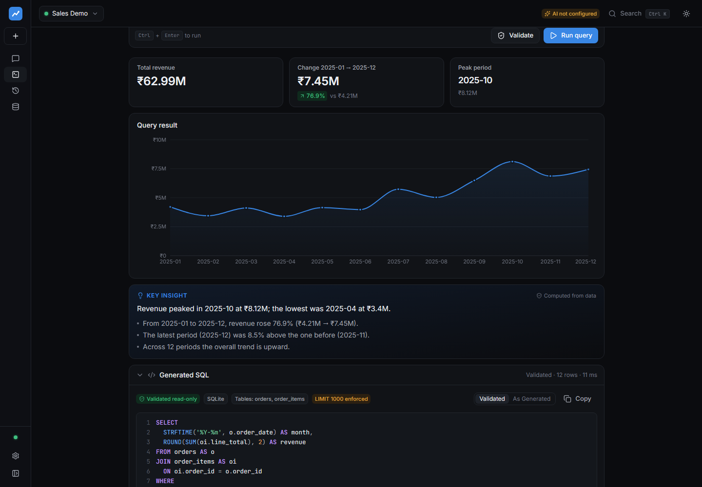
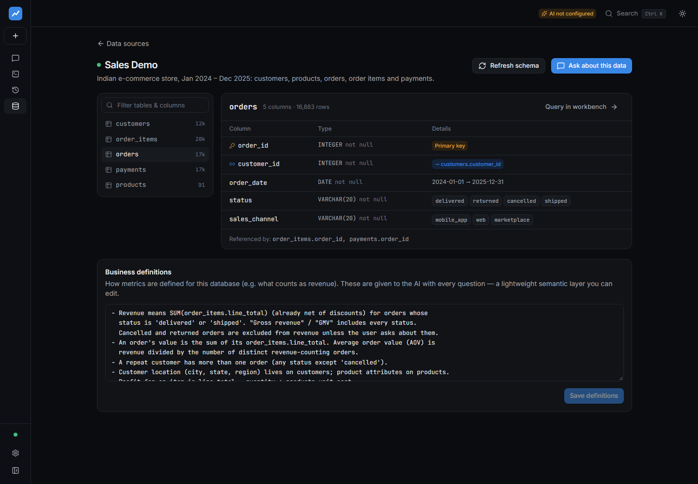
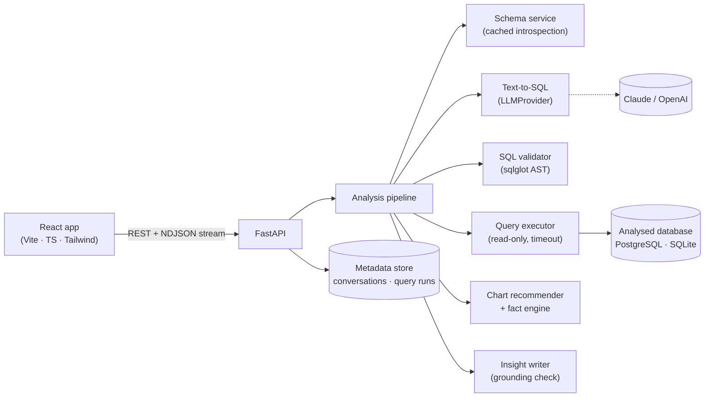
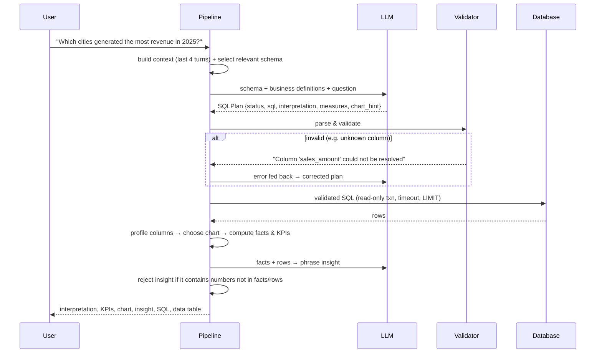

# DataPilot

**Ask your data anything.** DataPilot turns plain-English business questions into validated SQL, runs it
read-only against a relational database, and returns the answer as a chart, KPIs and a short insight,
with the SQL shown at every step.



It is built as an analytics workflow rather than a chatbot. The pipeline is:

```
question → schema-aware SQL → validation → read-only execution → chart → grounded insight
```

Every step is visible and checkable:
- the generated SQL and the SQL that actually ran;
- the validation result and any queries the system self-corrected;
- the rows returned;
- the facts that the insight was written from.

---

## Features

| | |
|---|---|
| **Natural-language questions** | Schema-aware text-to-SQL using structured (JSON-schema) LLM output, validated with Pydantic |
| **Visible, validated SQL** | Syntax-highlighted viewer with line numbers, copy, and "as generated" vs. "validated" toggle |
| **SQL safety** | AST-based validation (sqlglot), read-only transactions, statement timeouts, row limits, read-only DB role |
| **Self-correction** | Validation/execution errors are fed back to the model; up to 2 repair attempts, all shown to the user |
| **Automatic visualization** | Chart chosen from the *shape* of the result: line, bar, horizontal bar, donut, scatter, KPI, table |
| **Grounded insights** | Facts are computed from the rows; AI-written text is rejected if it contains a number not in the data |
| **Conversations** | Follow-ups ("which month was highest?") reuse earlier queries through bounded context |
| **Live progress** | Real pipeline events streamed from the server (NDJSON), not timers |
| **Clarification** | Ambiguous questions get a clarifying question with one-click options |
| **Schema explorer** | Tables, types, keys, relationships, value hints, and editable business definitions |
| **SQL workbench** | Hand-written SQL through the same validator, executor and analytics (works without an AI key) |
| **Query history** | Every query with status, rows and timing; reopen any analysis |



## Architecture



### The pipeline



Each stage is its own service with a single responsibility (`backend/app/services/`). The pipeline only
sequences them and turns failures into well-formed results.

### Key design decisions

- **SQL safety is enforced three times, independently.** First, `SQLValidator` parses the SQL into a
  syntax tree and applies these checks:
  - it accepts only a single `SELECT` (CTEs allowed);
  - it walks every node, including those inside CTEs and subqueries, and rejects
    `INSERT/UPDATE/DELETE/MERGE/DDL/COPY/SET/SELECT INTO/...`, so writable CTEs are caught;
  - it rejects dangerous functions (`pg_sleep`, `pg_read_file`, `dblink`, `set_config`, `nextval`, …);
  - it rejects tables outside the connected schema, including system catalogs;
  - it resolves every column against the live schema;
  - it enforces a `LIMIT`.

  Second, the executor runs SQL inside `SET TRANSACTION READ ONLY` with `statement_timeout` (Postgres), or
  on a `mode=ro` connection with a progress-handler deadline (SQLite). Third, in Docker the demo is queried
  through a role that only has `SELECT`. The validator and the read-only execution layer are each tested
  on their own, so neither depends on the other to block a write.
- **Generated SQL and validated SQL are different objects.** The executor only accepts a successful
  `ValidationResult`, so unvalidated SQL has no code path to the database.
- **Insights cannot invent numbers.** `compute_facts` derives statements deterministically: top item,
  share of total, period-over-period change, peak, trend and correlation. The LLM may only rephrase
  them. `numbers_are_grounded` checks every number in the model's text against the facts and rows. If any
  number fails, or no LLM is configured, the computed facts are shown instead.
- **The chart comes from the data.** Column kinds (temporal / numeric / categorical / identifier) are
  inferred from values and names, and the chart type follows from the result's shape. The model's
  `chart_hint` only breaks ties.
- **The LLM sits behind a provider interface.** `LLMProvider.generate_structured(...)` returns a
  validated Pydantic object. Anthropic (default, JSON-schema structured outputs) and OpenAI are
  implemented, and switching is a config change. Tests use a scripted fake provider.
- **Business definitions work as a lightweight semantic layer.** Each data source has editable notes,
  such as how "revenue" is computed, and these are sent with every question. The demo defines revenue as
  delivered and shipped orders.
- **Context is bounded.** Only the last *N* turns (default 4) are sent to the model, each summarised as
  question, interpretation, SQL, columns and 5 sample rows. For large schemas, only relevant tables plus
  their foreign-key join paths are sent.
- **Result sets are not stored.** Messages keep a bounded preview (≤500 rows) so past analyses reopen
  instantly, and query runs keep metadata only.

## Tech stack

| Layer | Choices |
|---|---|
| Frontend | React 19, TypeScript, Vite, Tailwind CSS 4, Radix UI primitives (shadcn-style), Recharts, TanStack Query, Zustand, Lucide |
| Backend | Python 3.12+, FastAPI, Pydantic v2, SQLAlchemy 2, Alembic, sqlglot, psycopg 3 |
| AI | Anthropic SDK (Claude, structured outputs), OpenAI SDK, provider abstraction |
| Data | PostgreSQL 16 (primary), SQLite (zero-setup local mode) |
| Quality | pytest (SQLite + PostgreSQL), Vitest + Testing Library, ruff, mypy, oxlint, GitHub Actions |

## Getting started

### Option A: Docker (PostgreSQL, recommended)

```bash
cp .env.example .env          # optionally add ANTHROPIC_API_KEY
docker compose up --build
```

Open **http://localhost:8080**. On first start:
- Postgres creates the `sales_demo` database and a read-only `datapilot_reader` role;
- the backend runs migrations, seeds the demo data and registers it as a data source.

### Option B: Local development (no Docker, uses SQLite)

Requires Python 3.12+ and Node 20+.

```bash
# Backend  → http://localhost:8000  (API docs at /docs)
cd backend
python -m venv .venv
.venv/Scripts/activate           # Windows;  source .venv/bin/activate on macOS/Linux
pip install -r requirements-dev.txt
cp ../.env.example .env          # optional: add ANTHROPIC_API_KEY
uvicorn app.main:app --reload

# Frontend → http://localhost:5173  (proxies /api to :8000)
cd frontend
npm install
npm run dev
```

The first backend start creates `backend/data/datapilot.db`, the metadata store, and
`backend/data/demo_sales.db`, the demo data, in about 3 seconds. To regenerate the demo data, run
`python -m scripts.seed_demo --force`.

**Without an API key**, schema exploration, the SQL workbench (with charts, KPIs and computed insights)
and query history all work. Chat shows a clear "AI not configured" state.

## Environment variables

| Variable | Default | Purpose |
|---|---|---|
| `LLM_PROVIDER` | `anthropic` | `anthropic`, `openai` or `none` |
| `ANTHROPIC_API_KEY` / `OPENAI_API_KEY` | – | Provider credentials (server-side only) |
| `LLM_MODEL` | `claude-opus-5-5` / `gpt-4.1` | Model override |
| `ANTHROPIC_FALLBACKS` | `true` | Server-side refusal fallback to another Claude model |
| `DATABASE_URL` | SQLite in `backend/data/` | Metadata store |
| `DEMO_DATABASE_URL` | SQLite in `backend/data/` | Demo data source (queried) |
| `DEMO_SEED_DATABASE_URL` | – | Separate owner URL used only for seeding |
| `SECRET_KEY` | dev value | Encrypts stored connection strings (**set in production**) |
| `QUERY_TIMEOUT_SECONDS` | `15` | Statement timeout |
| `MAX_RESULT_ROWS` | `1000` | Enforced row limit |
| `MAX_SQL_REPAIR_ATTEMPTS` | `2` | Self-correction attempts |
| `CONTEXT_TURNS` | `4` | Conversation turns sent as context |

## Demo dataset

This is a synthetic but realistic Indian e-commerce business (₹, Jan 2024 – Dec 2025), generated
deterministically by `backend/app/demo/seed.py`.

| Table | Rows | Notes |
|---|---:|---|
| `customers` | 12,000 | 24 cities / 4 regions, segments (Consumer, Small Business, Corporate), acquisition channel |
| `products` | 91 | 6 categories, 25 subcategories, price & cost, launch dates |
| `orders` | ~16,900 | status (delivered / shipped / cancelled / returned), sales channel |
| `order_items` | ~27,900 | quantity, unit price, discount, line total |
| `payments` | ~16,800 | method (UPI, cards, COD, …), refunds |

The data is built to make analysis non-trivial:
- **Growth and seasonality:** revenue grows ~38% year-over-year, with a festive (Diwali) peak in Oct/Nov
  and sale-event spikes.
- **Customers:** heavy-tailed, with a ~34% repeat-buyer rate.
- **Products and categories:** some products clearly decline while new launches ramp up, and return
  rates differ by category.
- **Payments:** the mix shifts from cash-on-delivery toward UPI.

### Questions to try

- What were our top 5 products by revenue?
- Show monthly revenue for 2025. → *Which month was highest?* → *Compare it with the previous year.*
- Which city generated the highest sales?
- What is the average order value by customer segment?
- Which products have declining sales?
- Compare revenue between 2024 and 2025 by month.
- What percentage of customers made more than one purchase?
- How has the share of UPI payments changed over time?

## API overview

Interactive docs are at `http://localhost:8000/docs`.

| Method | Endpoint | Purpose |
|---|---|---|
| `GET` | `/api/health` | DB + AI provider status |
| `GET` `POST` | `/api/datasets` | List / register data sources (connection tested before saving) |
| `GET` `PATCH` `DELETE` | `/api/datasets/{id}` | Read / update business definitions / remove |
| `GET` | `/api/datasets/{id}/schema` | Tables, columns, keys, relationships, value hints (`?refresh=true`) |
| `POST` | `/api/chat` | Ask a question, get the full answer |
| `POST` | `/api/chat/stream` | Same, streaming NDJSON progress events |
| `GET` `DELETE` | `/api/conversations[/{id}]` | Conversation list / detail / delete |
| `POST` | `/api/query/validate` | Validate SQL without running it |
| `POST` | `/api/query/execute` | Validate + run SQL, returning chart, KPIs and facts |
| `GET` | `/api/query/history` | Query runs with status, rows and timing |

Errors always use the same envelope: `{"error": {"code": "...", "message": "..."}}`. Internal exceptions
never reach the client.

## Security considerations

- **No secrets in the repo.** Configuration comes from the environment, and `.env` is git-ignored.
- **Credentials:** data-source URLs are encrypted at rest (Fernet) and only ever returned with the
  password masked.
- **Keys:** API keys and passwords are never logged, and third-party loggers are turned down to
  `WARNING` so they don't log SQL or request bodies.
- **Least privilege:**
  - Use a read-only database user for any data source you add.
  - SQLite sources must live inside the server's data directory.
  - Value hints are never sampled from columns that look like personal data (names, emails, phone
    numbers, addresses).
- **Logs:** structured JSON with a `request_id` (echoed as `X-Request-ID`), plus data source, status,
  row count and timings. Query results are not logged.

## Testing

```bash
cd backend  && pytest                  # 138 tests on SQLite; +5 PostgreSQL tests when TEST_POSTGRES_URL is set
cd backend  && ruff check . && mypy app
cd frontend && npm test && npm run lint && npm run typecheck
```

**Backend coverage:**
- **SQL safety:** 73 validator cases across both dialects, including writable CTEs, stacked statements,
  system catalogs, dangerous functions, unknown tables and columns, and limit enforcement.
- **Execution:** read-only enforcement, timeouts and truncation.
- **Analytics:** schema discovery, chart selection, fact computation and the grounding check.
- **Pipeline:** repair loops, clarification, empty results, malformed or unavailable LLM output, and
  follow-up context.
- **API:** all endpoints, including the streaming endpoint.

The PostgreSQL suite also covers `date_trunc`/`ILIKE`/`::numeric` queries, the statement timeout, and
the read-only transaction.

**Frontend coverage:** the chat flow with streamed progress, error and clarification states, the SQL
viewer, charts, KPIs, table sorting and pagination, dataset selection, and the workbench.

## Project structure

```
backend/
  app/
    api/routes/        health, datasets, chat (+stream), queries
    core/              config, logging, errors, security (encryption), url helpers
    datasources/       Connector protocol + SQLAlchemy connector (Postgres/SQLite), registry
    demo/              deterministic demo-data generator
    llm/               LLMProvider protocol, Anthropic & OpenAI providers, factory
    models/            SQLAlchemy models for the metadata store
    repositories/      data access for sources, conversations, query runs
    schemas/           Pydantic API + analysis contracts, structured LLM outputs
    services/          schema, text-to-SQL, validator, executor, analyzer, charts, insights, pipeline, chat
  alembic/             migrations
  tests/
frontend/
  src/
    components/        layout, chat, charts, sql, data, schema, common, ui
    pages/             Chat, Workbench, History, DataSources, Schema, Settings
    hooks/ services/ store/ lib/ types/ test/
docker/postgres/       init script (demo DB + read-only role)
docker-compose.yml
```

## Future improvements

- CSV / Excel upload into a sandboxed DuckDB data source
- MySQL and BigQuery connectors (the `Connector` protocol is the extension point)
- Saved dashboards built from pinned answers
- An evaluation set of question → expected-result pairs to measure text-to-SQL accuracy across models
- Embedding-based schema retrieval for warehouses with hundreds of tables
- Authentication and per-user workspaces
